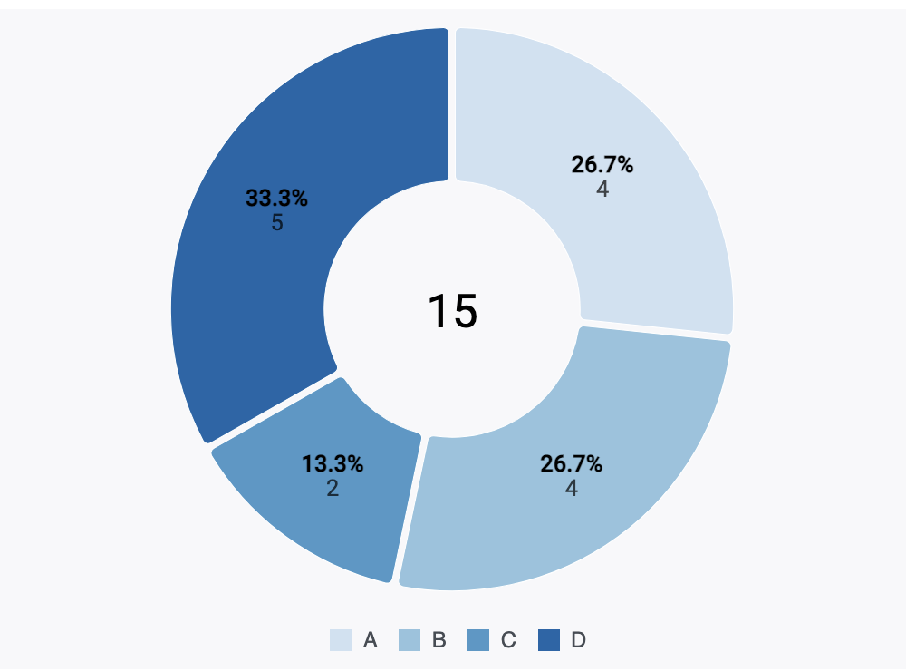
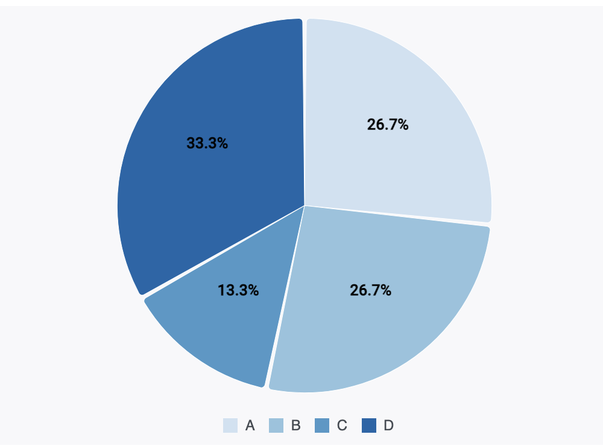

# Grafana Pie Chart Panel

Radial visualization divided into slices to illustrate numerical proportions between categories.

Donut Chart            | Pie Chart
:---------------------:|:-------------------------------------------------:
   |  

## Installing

Using the grafana-cli:

```bash
grafana-cli --pluginUrl https://github.com/IsmaelMasharo/pie-chart-panel/raw/master/pie-chart-panel.zip plugins install pie-chart-panel
```

## Grafana Version

Tested on Grafana 7.3.1

## Required Fields

The diagram gets constructed from a data source **formatted as table** with 2 mandatory fields: **category** (text), **value** (numeric).

The diagram at the beginning was created with the following table format:

| category | value |
|----------|-------|
| A        | 4     |
| B        | 4     |
| C        | 2     |
| D        | 5     |

## Display Options

### Legend Position

The legend can be placed at the *Bottom* or *Right* to the diagram.

### Pie Chart Centered

Boolean. Available when legend position is at *Right*. If true, the chart itself gets centered. When false, both the chart and the legend are used for center positioning.

### Color Scale

Color for categorical encodings.

### Display Totals

Boolean. If true, displays a *donut chart* with totals info; if false, displays a *pie chart* with only percentage values labels.